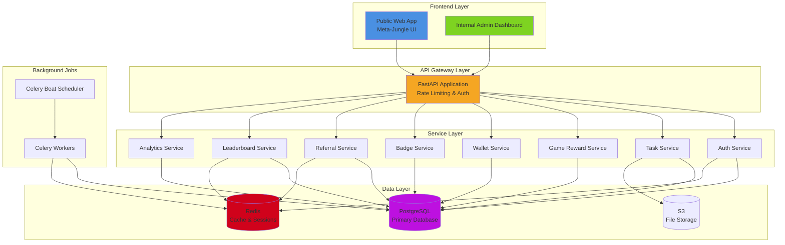
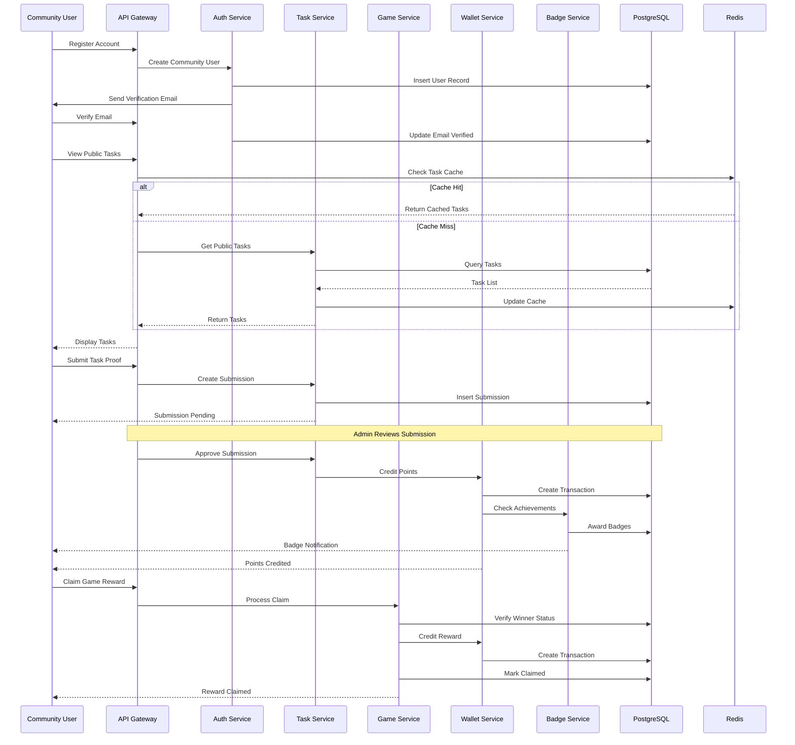

# Design Document: LPanda Public Gamified Ecosystem

## Overview

The LPanda Public Gamified Ecosystem extends the existing internal LPanda platform with public-facing capabilities, transforming it into a comprehensive community engagement system. This extension introduces a new Community_User role that enables external users to register, complete public tasks, participate in community events, claim rewards, and earn Panda Points. The design maintains complete backward compatibility with the existing internal system (Overall_Admin, Ambassador_Admin, Team_Member, Ambassador roles) while adding modular public-facing features.

The system implements a 10-step feature set including public user registration with email verification, a public task feed with category-based organization, a community game reward claim module for tournament winnings, a comprehensive Panda wallet dashboard, public leaderboards with time-based rankings, an achievement badge system, a referral program with abuse prevention, a unified user dashboard, admin analytics, and a futuristic "Meta-Jungle" UI theme.

This design follows a clean extension architecture that preserves all existing internal workflows, admin permissions, and RBAC rules while introducing new database tables, API endpoints, and services specifically for public community features.

## Architecture

### System Architecture Overview



### Component Integration Flow



## Components and Interfaces

### 1. Authentication Service

**Purpose**: Manages public user registration, email verification, and authentication for Community_User role.

**Interface**:
```python
class AuthService:
    def register_community_user(
        email: str,
        password: str,
        username: str,
        referral_code: Optional[str] = None
    ) -> CommunityUserRegistrationResponse
    
    def verify_email(verification_token: str) -> EmailVerificationResponse
    
    def login(email: str, password: str) -> LoginResponse
    
    def request_password_reset(email: str) -> PasswordResetResponse
    
    def reset_password(reset_token: str, new_password: str) -> PasswordResetConfirmResponse
```

**Responsibilities**:
- Create Community_User accounts with email verification
- Generate and validate email verification tokens (JWT with 24h expiry)
- Handle password hashing using bcrypt
- Process referral codes during registration
- Maintain backward compatibility with existing internal user authentication

### 2. Public Task Service

**Purpose**: Manages public task feed with category filtering and task submission workflow.

**Interface**:
```python
class PublicTaskService:
    def get_public_tasks(
        category: Optional[TaskCategory] = None,
        page: int = 1,
        page_size: int = 20
    ) -> PaginatedTaskResponse
    
    def get_task_details(task_id: UUID) -> PublicTaskDetail
    
    def submit_task_proof(
        task_id: UUID,
        user_id: UUID,
        content: str,
        files: List[UploadFile]
    ) -> TaskSubmissionResponse
    
    def get_user_submissions(
        user_id: UUID,
        status: Optional[SubmissionStatus] = None
    ) -> List[TaskSubmissionDetail]
```

**Responsibilities**:
- Filter and display public tasks by category (Social Media, Content Creation, Community Engagement, Surveys, Referrals)
- Handle task submission with file uploads to S3
- Track submission status (Pending, Approved, Rejected)
- Enforce one submission per user per task constraint

### 3. Game Reward Service

**Purpose**: Manages community game tournament rewards and claim processing.

**Interface**:
```python
class GameRewardService:
    def get_available_rewards(user_id: UUID) -> List[GameRewardDetail]
    
    def claim_reward(
        user_id: UUID,
        reward_id: UUID
    ) -> RewardClaimResponse
    
    def verify_winner_status(
        user_id: UUID,
        game_id: UUID
    ) -> WinnerVerificationResponse
    
    def get_claim_history(user_id: UUID) -> List[RewardClaimHistory]
```

**Responsibilities**:
- Display available unclaimed rewards for tournament winners
- Process reward claims with duplicate prevention
- Verify winner status from external game system
- Credit Panda Points to user wallet upon successful claim
- Track claim history with timestamps

### 4. Wallet Service

**Purpose**: Manages Panda Points wallet with transaction history and balance tracking.

**Interface**:
```python
class WalletService:
    def get_wallet_balance(user_id: UUID) -> WalletBalanceResponse
    
    def get_transaction_history(
        user_id: UUID,
        transaction_type: Optional[TransactionType] = None,
        page: int = 1,
        page_size: int = 20
    ) -> PaginatedTransactionResponse
    
    def credit_points(
        user_id: UUID,
        amount: float,
        transaction_type: TransactionType,
        reason: str,
        related_task_id: Optional[UUID] = None,
        related_submission_id: Optional[UUID] = None
    ) -> PointsCreditResponse
    
    def debit_points(
        user_id: UUID,
        amount: float,
        transaction_type: TransactionType,
        reason: str
    ) -> PointsDebitResponse
```

**Responsibilities**:
- Display current Panda Points balance
- Provide paginated transaction history with filtering
- Process point credits from task approvals and game rewards
- Process point debits for penalties or redemptions
- Maintain immutable transaction log for audit trail

### 5. Badge Service

**Purpose**: Manages achievement badge system with automatic awarding based on milestones.

**Interface**:
```python
class BadgeService:
    def get_user_badges(user_id: UUID) -> List[UserBadgeDetail]
    
    def check_and_award_badges(user_id: UUID) -> List[BadgeAwardResult]
    
    def get_badge_catalog() -> List[BadgeDefinition]
    
    def get_badge_progress(
        user_id: UUID,
        badge_id: UUID
    ) -> BadgeProgressDetail
```

**Responsibilities**:
- Define badge catalog with criteria (First Task, 10 Tasks, 100 Points, etc.)
- Automatically check and award badges after task approvals
- Track badge progress toward next milestone
- Display earned badges with timestamps
- Prevent duplicate badge awards

### 6. Referral Service

**Purpose**: Manages referral program with code generation and abuse prevention.

**Interface**:
```python
class ReferralService:
    def generate_referral_code(user_id: UUID) -> ReferralCodeResponse
    
    def validate_referral_code(code: str) -> ReferralCodeValidation
    
    def process_referral(
        referrer_code: str,
        new_user_id: UUID
    ) -> ReferralProcessingResponse
    
    def get_referral_stats(user_id: UUID) -> ReferralStatsResponse
    
    def detect_referral_abuse(user_id: UUID) -> AbuseDetectionResult
```

**Responsibilities**:
- Generate unique 8-character alphanumeric referral codes
- Validate referral codes during registration
- Award bonus points to referrer (50 PP) and referee (25 PP)
- Track referral count and total bonus earned
- Detect abuse patterns (same IP, rapid signups, inactive referrals)
- Enforce maximum referral limits per user

### 7. Leaderboard Service

**Purpose**: Manages public leaderboards with time-based rankings and caching.

**Interface**:
```python
class PublicLeaderboardService:
    def get_leaderboard(
        time_period: LeaderboardPeriod,
        page: int = 1,
        page_size: int = 50
    ) -> PaginatedLeaderboardResponse
    
    def get_user_rank(
        user_id: UUID,
        time_period: LeaderboardPeriod
    ) -> UserRankResponse
    
    def refresh_leaderboard_cache(
        time_period: LeaderboardPeriod
    ) -> CacheRefreshResult
```

**Responsibilities**:
- Display leaderboards for All-Time, Monthly, and Weekly periods
- Calculate rankings based on Panda Points earned in time period
- Cache leaderboard data in Redis for performance
- Refresh cache every 5 minutes via Celery Beat
- Show user's current rank and position change

### 8. Analytics Service

**Purpose**: Provides admin analytics for community engagement metrics.

**Interface**:
```python
class AnalyticsService:
    def get_community_overview() -> CommunityOverviewMetrics
    
    def get_task_engagement_metrics(
        start_date: datetime,
        end_date: datetime
    ) -> TaskEngagementMetrics
    
    def get_user_growth_metrics(
        start_date: datetime,
        end_date: datetime
    ) -> UserGrowthMetrics
    
    def get_referral_metrics() -> ReferralMetrics
    
    def get_badge_distribution() -> BadgeDistributionMetrics
```

**Responsibilities**:
- Track total community users, active users, and growth rate
- Monitor task submission rates and approval rates
- Analyze referral program effectiveness
- Report badge distribution and achievement rates
- Generate time-series data for charts and graphs

### 9. Dashboard Service

**Purpose**: Provides unified dashboard view for community users.

**Interface**:
```python
class DashboardService:
    def get_user_dashboard(user_id: UUID) -> UserDashboardResponse
    
    def get_activity_feed(
        user_id: UUID,
        page: int = 1,
        page_size: int = 10
    ) -> PaginatedActivityFeedResponse
    
    def get_quick_stats(user_id: UUID) -> QuickStatsResponse
```

**Responsibilities**:
- Display user's points balance, rank, and level
- Show recent activity (submissions, rewards, badges)
- Display available tasks and unclaimed rewards
- Show referral stats and progress toward next badge
- Provide quick access to all major features

### 10. UI Theme Service

**Purpose**: Manages Meta-Jungle futuristic UI theme with customization options.

**Interface**:
```python
class ThemeService:
    def get_theme_config() -> ThemeConfiguration
    
    def get_user_theme_preferences(user_id: UUID) -> UserThemePreferences
    
    def update_theme_preferences(
        user_id: UUID,
        preferences: ThemePreferencesUpdate
    ) -> ThemeUpdateResponse
```

**Responsibilities**:
- Provide Meta-Jungle theme configuration (colors, fonts, animations)
- Support dark/light mode toggle
- Allow accent color customization
- Manage animation preferences (reduced motion support)
- Store user theme preferences in database

## Data Models

### 1. CommunityUser (extends User table)

```python
class CommunityUser:
    # Inherits from existing User model
    id: UUID
    name: str
    email: str
    password_hash: str
    role: UserRole = UserRole.COMMUNITY_USER  # New enum value
    user_type: UserType = UserType.COMMUNITY_USER  # New enum value
    points: float = 0.0
    xp: float = 0.0
    level: int = 1
    current_streak: int = 0
    last_activity_at: datetime | None

    # New fields for Community Users
    username: str  # Public display name (unique)
    email_verified: bool = False
    email_verification_token: str | None
    email_verification_sent_at: datetime | None
    referral_code: str  # Unique 8-char code
    referred_by_id: UUID | None  # ID of referrer
    registration_ip: str | None
    last_login_ip: str | None
    is_active: bool = True

    created_at: datetime
    updated_at: datetime
    deleted_at: datetime | None
```

**Validation Rules**:
- `email` must be valid email format and unique
- `username` must be 3-20 characters, alphanumeric + underscore, unique
- `password` must be minimum 8 characters with complexity requirements
- `referral_code` must be exactly 8 characters, alphanumeric, unique
- `email_verification_token` expires after 24 hours

### 2. PublicTask (extends Task table)

```python
class PublicTask:
    # Inherits from existing Task model
    id: UUID
    title: str
    description: str
    deadline: datetime
    point_value: float
    created_by_id: UUID

    # New fields for Public Tasks
    is_public: bool = False  # Flag to distinguish public tasks
    category: TaskCategory  # New enum
    max_submissions: int | None  # Limit total submissions
    current_submissions: int = 0
    is_active: bool = True
    featured: bool = False
    difficulty_level: DifficultyLevel  # Easy, Medium, Hard
    estimated_time_minutes: int | None

    created_at: datetime
    updated_at: datetime
    deleted_at: datetime | None
```

**Validation Rules**:
- `category` must be one of: Social_Media, Content_Creation, Community_Engagement, Surveys, Referrals
- `point_value` must be positive
- `max_submissions` if set must be positive integer
- `current_submissions` cannot exceed `max_submissions`
- `difficulty_level` must be one of: Easy, Medium, Hard

### 3. GameReward

```python
class GameReward:
    id: UUID
    game_id: UUID  # External game system ID
    game_name: str
    tournament_name: str
    winner_user_id: UUID  # Community user who won
    reward_amount: float  # Panda Points
    placement: int  # 1st, 2nd, 3rd, etc.
    is_claimed: bool = False
    claimed_at: datetime | None
    verification_data: dict  # JSON with proof of win
    expires_at: datetime  # Claim deadline

    created_at: datetime
    updated_at: datetime
```

**Validation Rules**:
- `reward_amount` must be positive
- `placement` must be positive integer
- `expires_at` must be in the future when created
- Cannot claim after `expires_at`
- Cannot claim twice (is_claimed = True)

### 4. Badge

```python
class Badge:
    id: UUID
    name: str
    description: str
    icon_url: str
    badge_type: BadgeType  # Task_Based, Points_Based, Streak_Based, Special
    criteria: dict  # JSON with achievement criteria
    rarity: BadgeRarity  # Common, Rare, Epic, Legendary
    points_reward: float = 0.0  # Bonus points for earning badge

    created_at: datetime
    updated_at: datetime
```

**Validation Rules**:
- `name` must be unique
- `badge_type` must be one of: Task_Based, Points_Based, Streak_Based, Special
- `rarity` must be one of: Common, Rare, Epic, Legendary
- `criteria` must contain valid JSON with required fields based on badge_type

### 5. UserBadge

```python
class UserBadge:
    id: UUID
    user_id: UUID
    badge_id: UUID
    earned_at: datetime
    progress: float = 0.0  # Progress toward next tier (0.0-1.0)

    # Unique constraint on (user_id, badge_id)
```

**Validation Rules**:
- Cannot award same badge to user twice
- `progress` must be between 0.0 and 1.0
- `earned_at` cannot be in the future

### 6. Referral

```python
class Referral:
    id: UUID
    referrer_id: UUID  # User who referred
    referee_id: UUID  # User who was referred
    referral_code: str  # Code used
    referrer_bonus: float = 50.0  # Points to referrer
    referee_bonus: float = 25.0  # Points to referee
    is_bonus_awarded: bool = False
    bonus_awarded_at: datetime | None
    referee_completed_first_task: bool = False  # Bonus condition

    created_at: datetime
```

**Validation Rules**:
- `referrer_id` cannot equal `referee_id`
- Cannot refer same user twice
- `referral_code` must match referrer's code
- Bonus only awarded after referee completes first task

### 7. PublicLeaderboard (extends LeaderboardCache)

```python
class PublicLeaderboard:
    id: UUID
    user_id: UUID
    username: str  # Denormalized for performance
    time_period: LeaderboardPeriod  # All_Time, Monthly, Weekly
    rank: int
    points_earned: float
    tasks_completed: int
    badges_earned: int
    rank_change: int  # Change from previous period

    period_start: datetime
    period_end: datetime
    updated_at: datetime

    # Composite index on (time_period, rank)
    # Unique constraint on (user_id, time_period)
```

**Validation Rules**:
- `time_period` must be one of: All_Time, Monthly, Weekly
- `rank` must be positive integer
- `points_earned` must be non-negative
- `period_start` must be before `period_end`

### 8. UserThemePreference

```python
class UserThemePreference:
    id: UUID
    user_id: UUID  # Unique
    theme_mode: ThemeMode = ThemeMode.DARK  # Dark, Light
    accent_color: str = "#00FF88"  # Hex color
    enable_animations: bool = True
    reduce_motion: bool = False
    font_size: FontSize = FontSize.MEDIUM  # Small, Medium, Large

    created_at: datetime
    updated_at: datetime
```

**Validation Rules**:
- `theme_mode` must be one of: Dark, Light
- `accent_color` must be valid hex color format
- `font_size` must be one of: Small, Medium, Large
- One preference record per user

### 9. CommunityAnalytics (Aggregated View)

```python
class CommunityAnalytics:
    id: UUID
    date: date  # Daily aggregation
    total_users: int
    new_users: int
    active_users: int  # Users with activity in last 7 days
    total_tasks_submitted: int
    total_tasks_approved: int
    total_points_awarded: float
    total_referrals: int
    total_badges_awarded: int
    avg_tasks_per_user: float

    created_at: datetime
```

**Validation Rules**:
- All count fields must be non-negative
- `date` must be unique
- `avg_tasks_per_user` calculated as total_tasks_submitted / active_users

### 10. AbuseDetectionLog

```python
class AbuseDetectionLog:
    id: UUID
    user_id: UUID
    abuse_type: AbuseType  # Referral_Spam, Multi_Account, Bot_Activity, Suspicious_Pattern
    severity: AbuseSeverity  # Low, Medium, High, Critical
    detection_method: str
    evidence: dict  # JSON with detection details
    is_resolved: bool = False
    resolved_at: datetime | None
    resolved_by_id: UUID | None
    action_taken: str | None

    created_at: datetime
```

**Validation Rules**:
- `abuse_type` must be one of: Referral_Spam, Multi_Account, Bot_Activity, Suspicious_Pattern
- `severity` must be one of: Low, Medium, High, Critical
- `evidence` must contain valid JSON
- If `is_resolved` is True, `resolved_at` and `resolved_by_id` must be set

## Correctness Properties

### Authentication & Authorization Properties

**Property 1: Email Uniqueness**
```
∀ u1, u2 ∈ CommunityUsers: u1.email = u2.email ⟹ u1.id = u2.id
```
No two different users can have the same email address.

**Property 2: Email Verification Required**
```
∀ u ∈ CommunityUsers, ∀ action ∈ ProtectedActions:
  canPerform(u, action) ⟹ u.email_verified = true
```
Community users must verify email before performing protected actions (task submission, reward claims).

**Property 3: Referral Code Uniqueness**
```
∀ u1, u2 ∈ CommunityUsers: u1.referral_code = u2.referral_code ⟹ u1.id = u2.id
```
Each user has a unique referral code.

**Property 4: No Self-Referral**
```
∀ r ∈ Referrals: r.referrer_id ≠ r.referee_id
```
Users cannot refer themselves.

### Task Submission Properties

**Property 5: One Submission Per Task**
```
∀ u ∈ CommunityUsers, ∀ t ∈ PublicTasks:
  |{s ∈ TaskSubmissions: s.user_id = u.id ∧ s.task_id = t.id}| ≤ 1
```
Each user can submit at most one submission per public task.

**Property 6: Submission Deadline Enforcement**
```
∀ s ∈ TaskSubmissions, ∀ t ∈ PublicTasks:
  s.task_id = t.id ⟹ s.submitted_at ≤ t.deadline
```
Task submissions must be submitted before the task deadline.

**Property 7: Points Awarded Only on Approval**
```
∀ s ∈ TaskSubmissions, ∀ tx ∈ PointsTransactions:
  tx.related_submission_id = s.id ∧ tx.amount > 0 ⟹ s.status = Approved
```
Points are only credited when submission status is Approved.

### Wallet & Points Properties

**Property 8: Transaction Immutability**
```
∀ tx ∈ PointsTransactions: ¬∃ update(tx)
```
Points transactions are immutable once created (append-only log).

**Property 9: Balance Consistency**
```
∀ u ∈ CommunityUsers:
  u.points = Σ(tx.amount: tx ∈ PointsTransactions ∧ tx.user_id = u.id)
```
User's points balance equals the sum of all their transactions.

**Property 10: Non-Negative Balance**
```
∀ u ∈ CommunityUsers: u.points ≥ 0
```
User points balance cannot be negative.

### Game Reward Properties

**Property 11: Reward Claim Once**
```
∀ r ∈ GameRewards: r.is_claimed = true ⟹ ∃! claim_event
```
Each game reward can only be claimed exactly once.

**Property 12: Reward Expiration**
```
∀ r ∈ GameRewards, ∀ claim_attempt at time t:
  canClaim(r, t) ⟹ t ≤ r.expires_at
```
Rewards cannot be claimed after expiration date.

**Property 13: Winner Verification**
```
∀ r ∈ GameRewards:
  r.is_claimed = true ⟹ verifyWinner(r.winner_user_id, r.game_id, r.verification_data) = true
```
Rewards can only be claimed by verified winners.

### Badge Properties

**Property 14: Badge Uniqueness Per User**
```
∀ u ∈ CommunityUsers, ∀ b ∈ Badges:
  |{ub ∈ UserBadges: ub.user_id = u.id ∧ ub.badge_id = b.id}| ≤ 1
```
Each user can earn each badge at most once.

**Property 15: Badge Criteria Satisfaction**
```
∀ ub ∈ UserBadges, ∀ b ∈ Badges:
  ub.badge_id = b.id ⟹ satisfiesCriteria(ub.user_id, b.criteria) = true
```
Badges are only awarded when user satisfies the badge criteria.

### Referral Properties

**Property 16: Referral Bonus Condition**
```
∀ r ∈ Referrals:
  r.is_bonus_awarded = true ⟹ r.referee_completed_first_task = true
```
Referral bonuses are only awarded after referee completes their first task.

**Property 17: Referral Limit**
```
∀ u ∈ CommunityUsers:
  |{r ∈ Referrals: r.referrer_id = u.id}| ≤ MAX_REFERRALS_PER_USER
```
Users have a maximum limit on number of referrals (configurable, e.g., 100).

**Property 18: No Duplicate Referrals**
```
∀ r1, r2 ∈ Referrals:
  r1.referee_id = r2.referee_id ⟹ r1.id = r2.id
```
Each user can only be referred once.

### Leaderboard Properties

**Property 19: Rank Uniqueness**
```
∀ period ∈ LeaderboardPeriods, ∀ l1, l2 ∈ PublicLeaderboard:
  l1.time_period = period ∧ l2.time_period = period ∧ l1.rank = l2.rank ⟹ l1.id = l2.id
```
Within each time period, each rank position is unique.

**Property 20: Rank Ordering**
```
∀ period ∈ LeaderboardPeriods, ∀ l1, l2 ∈ PublicLeaderboard:
  l1.time_period = period ∧ l2.time_period = period ∧ l1.rank < l2.rank
  ⟹ l1.points_earned ≥ l2.points_earned
```
Higher ranks have equal or more points than lower ranks.

## Error Handling

### Authentication Errors

**Error 1: Email Already Registered**
- **Condition**: User attempts to register with an email that already exists
- **Response**: HTTP 409 Conflict with error code `EMAIL_ALREADY_EXISTS`
- **Recovery**: Prompt user to login or use password reset

**Error 2: Invalid Email Verification Token**
- **Condition**: Email verification token is expired, invalid, or already used
- **Response**: HTTP 400 Bad Request with error code `INVALID_VERIFICATION_TOKEN`
- **Recovery**: Allow user to request new verification email

**Error 3: Email Not Verified**
- **Condition**: User attempts protected action without verified email
- **Response**: HTTP 403 Forbidden with error code `EMAIL_NOT_VERIFIED`
- **Recovery**: Redirect to email verification page with resend option

**Error 4: Invalid Credentials**
- **Condition**: Login attempt with incorrect email or password
- **Response**: HTTP 401 Unauthorized with error code `INVALID_CREDENTIALS`
- **Recovery**: Offer password reset link after 3 failed attempts

**Error 5: Account Suspended**
- **Condition**: User account is suspended due to abuse detection
- **Response**: HTTP 403 Forbidden with error code `ACCOUNT_SUSPENDED`
- **Recovery**: Display suspension reason and appeal contact information

### Task Submission Errors

**Error 6: Task Not Found**
- **Condition**: User attempts to submit to non-existent or deleted task
- **Response**: HTTP 404 Not Found with error code `TASK_NOT_FOUND`
- **Recovery**: Redirect to public task feed

**Error 7: Task Deadline Passed**
- **Condition**: User attempts submission after task deadline
- **Response**: HTTP 400 Bad Request with error code `DEADLINE_PASSED`
- **Recovery**: Display deadline and suggest other available tasks

**Error 8: Duplicate Submission**
- **Condition**: User attempts to submit to task they already submitted to
- **Response**: HTTP 409 Conflict with error code `DUPLICATE_SUBMISSION`
- **Recovery**: Show existing submission status and allow editing if pending

**Error 9: Task Submission Limit Reached**
- **Condition**: Task has reached maximum submissions limit
- **Response**: HTTP 400 Bad Request with error code `SUBMISSION_LIMIT_REACHED`
- **Recovery**: Display message and suggest alternative tasks

**Error 10: File Upload Failed**
- **Condition**: File upload to S3 fails due to size, type, or service error
- **Response**: HTTP 400 Bad Request with error code `FILE_UPLOAD_FAILED`
- **Recovery**: Retry upload with exponential backoff, validate file before upload

### Wallet & Points Errors

**Error 11: Insufficient Balance**
- **Condition**: User attempts to spend more points than available balance
- **Response**: HTTP 400 Bad Request with error code `INSUFFICIENT_BALANCE`
- **Recovery**: Display current balance and suggest earning more points

**Error 12: Transaction Failed**
- **Condition**: Database transaction fails during points credit/debit
- **Response**: HTTP 500 Internal Server Error with error code `TRANSACTION_FAILED`
- **Recovery**: Retry with idempotency key, rollback on failure, log for manual review

**Error 13: Invalid Transaction Amount**
- **Condition**: Transaction amount is negative, zero, or exceeds limits
- **Response**: HTTP 400 Bad Request with error code `INVALID_AMOUNT`
- **Recovery**: Validate amount on client side before submission

### Game Reward Errors

**Error 14: Reward Already Claimed**
- **Condition**: User attempts to claim reward that was already claimed
- **Response**: HTTP 409 Conflict with error code `REWARD_ALREADY_CLAIMED`
- **Recovery**: Display claim history and timestamp

**Error 15: Reward Expired**
- **Condition**: User attempts to claim reward after expiration date
- **Response**: HTTP 400 Bad Request with error code `REWARD_EXPIRED`
- **Recovery**: Display expiration date and suggest contacting support

**Error 16: Winner Verification Failed**
- **Condition**: Cannot verify user as legitimate winner of tournament
- **Response**: HTTP 403 Forbidden with error code `VERIFICATION_FAILED`
- **Recovery**: Log incident, require manual admin review

### Referral Errors

**Error 17: Invalid Referral Code**
- **Condition**: User enters non-existent or malformed referral code
- **Response**: HTTP 400 Bad Request with error code `INVALID_REFERRAL_CODE`
- **Recovery**: Allow registration to proceed without referral bonus

**Error 18: Self-Referral Attempt**
- **Condition**: User attempts to use their own referral code
- **Response**: HTTP 400 Bad Request with error code `SELF_REFERRAL_NOT_ALLOWED`
- **Recovery**: Clear referral code field and display error message

**Error 19: Referral Limit Exceeded**
- **Condition**: Referrer has reached maximum referral limit
- **Response**: HTTP 400 Bad Request with error code `REFERRAL_LIMIT_EXCEEDED`
- **Recovery**: Allow registration but don't award referral bonus

**Error 20: Referral Abuse Detected**
- **Condition**: System detects suspicious referral patterns (same IP, rapid signups)
- **Response**: HTTP 403 Forbidden with error code `REFERRAL_ABUSE_DETECTED`
- **Recovery**: Flag for manual review, temporarily block referral bonuses

---

## 11. API Endpoints

### Community Authentication
- `POST /api/v1/community/register`
  - Register community user
  - Request: `email`, `password`, `username`, optional `referral_code`
  - Response: user profile, `email_verified=false`
- `POST /api/v1/community/verify-email`
  - Verify email token
  - Response: success boolean
- `POST /api/v1/community/resend-verification`
  - Send a new verification email
- `POST /api/v1/community/login`
  - Authenticate community user
  - Response: access token, refresh token, user profile
- `POST /api/v1/community/password-reset-request`
- `POST /api/v1/community/password-reset-confirm`

### Public Task Feed
- `GET /api/v1/community/tasks`
  - Returns paginated public tasks
  - Supports `category`, `page`, `page_size`
- `GET /api/v1/community/tasks/{task_id}`
  - Returns task details
- `POST /api/v1/community/tasks/{task_id}/submit`
  - Submit proof for a public task
  - Requires verified email
  - Supports optional files
- `GET /api/v1/community/submissions`
  - Get authenticated user’s submissions

### Wallet & Rewards
- `GET /api/v1/community/wallet`
  - Current points balance, pending rewards, lifetime earnings
- `GET /api/v1/community/wallet/transactions`
  - Paginated transaction history
- `GET /api/v1/community/rewards`
  - Available game rewards
- `POST /api/v1/community/rewards/{reward_id}/claim`
  - Claim a reward
- `GET /api/v1/community/rewards/history`

### Badges & Leaderboards
- `GET /api/v1/community/badges`
  - Earned badges
- `GET /api/v1/community/badges/catalog`
  - Badge catalog with earned/unearned state
- `GET /api/v1/community/badges/progress`
  - Progress toward next badge
- `GET /api/v1/community/leaderboard`
  - Top ranks for `All_Time`, `Monthly`, `Weekly`
- `GET /api/v1/community/leaderboard/my-rank`

### Referral & Community
- `GET /api/v1/community/referral-code`
- `GET /api/v1/community/referrals/stats`
- `GET /api/v1/community/dashboard`
- `GET /api/v1/community/dashboard/quick-stats`

### Admin Analytics
- `GET /api/v1/admin/analytics/overview`
- `GET /api/v1/admin/analytics/tasks`
- `GET /api/v1/admin/analytics/referrals`
- `GET /api/v1/admin/analytics/badges`
- `GET /api/v1/admin/analytics/growth`

## 12. Database Migration Strategy

### Schema Extensions
- Extend `users` table with:
  - `username`, `email_verified`, `email_verification_token`
  - `email_verification_sent_at`, `referral_code`, `referred_by_id`
  - `registration_ip`, `last_login_ip`, `is_active`
- Extend `tasks` table with:
  - `is_public`, `category`, `max_submissions`, `current_submissions`
  - `is_active`, `featured`, `difficulty_level`, `estimated_time_minutes`
- Create new tables:
  - `game_rewards`
  - `badges`
  - `user_badges`
  - `referrals`
  - `public_leaderboards`
  - `user_theme_preferences`
  - `community_analytics`
  - `abuse_detection_logs`

### Migration Principles
- Add nullable columns or defaults for backward compatibility
- Create indexes for query-heavy fields: `referral_code`, `category`, `is_public`, `expires_at`
- Use migrations to seed initial badge catalog and theme defaults
- Validate with staging run before production rollout

## 13. Security & Compliance

### Authentication
- Use JWT access tokens with short expiration (15 minutes)
- Use refresh tokens with rotated storage
- Store only hashed passwords using bcrypt
- Enforce `email_verified=true` for key actions
- Lock accounts on abuse detection and provide appeal flow

### Authorization
- Keep existing RBAC intact
- New community routes only accessible to `Community_User` role where appropriate
- Admin analytics and reward claims require `Overall_Admin` or explicit admin allowance where defined

### Data Safety
- Sanitize all user inputs with Pydantic
- Reject unsafe file types and size violations before upload
- Validate file MIME type and extension
- Use presigned S3 URLs for file upload/download
- Keep file metadata in DB, not raw file content unless securely required

### Abuse Prevention
- Detect:
  - same IP referrals
  - rapid multi-account creation
  - inactive referral chains
- Log incidents in `abuse_detection_logs`
- Temporarily suspend or flag suspicious accounts
- Provide admin resolution endpoint

## 14. Monitoring & Observability

### Metrics
- Community registrations / day
- Public task submission rate
- Submission approval rate
- Points awarded per day
- Referral conversion rate
- Badge award rate
- Leaderboard refresh latency

### Logging
- Structured request/response logs
- Audit logs for all admin actions
- Error tracking with Sentry
- Rate-limit and auth failure logging

### Alerts
- High error rates (>1%)
- Redis or DB connectivity issues
- Failed reward claims
- Excessive referral abuse signals
- Queue backlog for Celery workers

## 15. Deployment

### Architecture
- FastAPI app behind API gateway
- PostgreSQL primary database
- Redis for cache, sessions, leaderboard, abuse signal state
- S3/MinIO for file storage
- Celery workers and Beat for periodic tasks

### Release Plan
1. Deploy schema changes in rolling migration
2. Release community-specific endpoints and services behind a feature flag
3. Monitor metrics, errors, and abuse signals closely during initial rollout
4. Gradually expand access to the broader community user base once stable

### Rollback Strategy
- Keep migration rollback paths available for non-destructive columns
- Disable feature flag if critical issues are detected
- Preserve data integrity and avoid dropping new tables immediately

### Post-Release
- Validate public task feed and submission flow end-to-end
- Confirm leaderboard and wallet balances sync correctly
- Review analytics and referral program metrics
- Iterate based on user feedback

## Correctness Properties

### Authentication & Authorization Properties

**Property 1: Email Uniqueness**
```
∀ u1, u2 ∈ CommunityUsers: u1.email = u2.email ⟹ u1.id = u2.id
```
No two different users can have the same email address.

**Property 2: Email Verification Required**
```
∀ u ∈ CommunityUsers, ∀ action ∈ ProtectedActions:
  canPerform(u, action) ⟹ u.email_verified = true
```
Community users must verify email before performing protected actions (task submission, reward claims).

**Property 3: Referral Code Uniqueness**
```
∀ u1, u2 ∈ CommunityUsers: u1.referral_code = u2.referral_code ⟹ u1.id = u2.id
```
Each user has a unique referral code.

**Property 4: No Self-Referral**
```
∀ r ∈ Referrals: r.referrer_id ≠ r.referee_id
```
Users cannot refer themselves.

### Task Submission Properties

**Property 5: One Submission Per Task**
```
∀ u ∈ CommunityUsers, ∀ t ∈ PublicTasks:
  |{s ∈ TaskSubmissions: s.user_id = u.id ∧ s.task_id = t.id}| ≤ 1
```
Each user can submit at most one submission per public task.

**Property 6: Submission Deadline Enforcement**
```
∀ s ∈ TaskSubmissions, ∀ t ∈ PublicTasks:
  s.task_id = t.id ⟹ s.submitted_at ≤ t.deadline
```
Task submissions must be submitted before the task deadline.

**Property 7: Points Awarded Only on Approval**
```
∀ s ∈ TaskSubmissions, ∀ tx ∈ PointsTransactions:
  tx.related_submission_id = s.id ∧ tx.amount > 0 ⟹ s.status = Approved
```
Points are only credited when submission status is Approved.

### Wallet & Points Properties

**Property 8: Transaction Immutability**
```
∀ tx ∈ PointsTransactions: ¬∃ update(tx)
```
Points transactions are immutable once created (append-only log).

**Property 9: Balance Consistency**
```
∀ u ∈ CommunityUsers:
  u.points = Σ(tx.amount: tx ∈ PointsTransactions ∧ tx.user_id = u.id)
```
User's points balance equals the sum of all their transactions.

**Property 10: Non-Negative Balance**
```
∀ u ∈ CommunityUsers: u.points ≥ 0
```
User points balance cannot be negative.


### Game Reward Properties

**Property 11: Reward Claim Once**
```
∀ r ∈ GameRewards: r.is_claimed = true ⟹ ∃! claim_event
```
Each game reward can only be claimed exactly once.

**Property 12: Reward Expiration**
```
∀ r ∈ GameRewards, ∀ claim_attempt at time t:
  canClaim(r, t) ⟹ t ≤ r.expires_at
```
Rewards cannot be claimed after expiration date.

**Property 13: Winner Verification**
```
∀ r ∈ GameRewards:
  r.is_claimed = true ⟹ verifyWinner(r.winner_user_id, r.game_id, r.verification_data) = true
```
Rewards can only be claimed by verified winners.

### Badge Properties

**Property 14: Badge Uniqueness Per User**
```
∀ u ∈ CommunityUsers, ∀ b ∈ Badges:
  |{ub ∈ UserBadges: ub.user_id = u.id ∧ ub.badge_id = b.id}| ≤ 1
```
Each user can earn each badge at most once.

**Property 15: Badge Criteria Satisfaction**
```
∀ ub ∈ UserBadges, ∀ b ∈ Badges:
  ub.badge_id = b.id ⟹ satisfiesCriteria(ub.user_id, b.criteria) = true
```
Badges are only awarded when user satisfies the badge criteria.

### Referral Properties

**Property 16: Referral Bonus Condition**
```
∀ r ∈ Referrals:
  r.is_bonus_awarded = true ⟹ r.referee_completed_first_task = true
```
Referral bonuses are only awarded after referee completes their first task.

**Property 17: Referral Limit**
```
∀ u ∈ CommunityUsers:
  |{r ∈ Referrals: r.referrer_id = u.id}| ≤ MAX_REFERRALS_PER_USER
```
Users have a maximum limit on number of referrals (configurable, e.g., 100).

**Property 18: No Duplicate Referrals**
```
∀ r1, r2 ∈ Referrals:
  r1.referee_id = r2.referee_id ⟹ r1.id = r2.id
```
Each user can only be referred once.

### Leaderboard Properties

**Property 19: Rank Uniqueness**
```
∀ period ∈ LeaderboardPeriods, ∀ l1, l2 ∈ PublicLeaderboard:
  l1.time_period = period ∧ l2.time_period = period ∧ l1.rank = l2.rank ⟹ l1.id = l2.id
```
Within each time period, each rank position is unique.

**Property 20: Rank Ordering**
```
∀ period ∈ LeaderboardPeriods, ∀ l1, l2 ∈ PublicLeaderboard:
  l1.time_period = period ∧ l2.time_period = period ∧ l1.rank < l2.rank
  ⟹ l1.points_earned ≥ l2.points_earned
```
Higher ranks have equal or more points than lower ranks.


## Error Handling

### Authentication Errors

**Error 1: Email Already Registered**
- **Condition**: User attempts to register with an email that already exists
- **Response**: HTTP 409 Conflict with error code `EMAIL_ALREADY_EXISTS`
- **Recovery**: Prompt user to login or use password reset

**Error 2: Invalid Email Verification Token**
- **Condition**: Email verification token is expired, invalid, or already used
- **Response**: HTTP 400 Bad Request with error code `INVALID_VERIFICATION_TOKEN`
- **Recovery**: Allow user to request new verification email

**Error 3: Email Not Verified**
- **Condition**: User attempts protected action without verified email
- **Response**: HTTP 403 Forbidden with error code `EMAIL_NOT_VERIFIED`
- **Recovery**: Redirect to email verification page with resend option

**Error 4: Invalid Credentials**
- **Condition**: Login attempt with incorrect email or password
- **Response**: HTTP 401 Unauthorized with error code `INVALID_CREDENTIALS`
- **Recovery**: Offer password reset link after 3 failed attempts

**Error 5: Account Suspended**
- **Condition**: User account is suspended due to abuse detection
- **Response**: HTTP 403 Forbidden with error code `ACCOUNT_SUSPENDED`
- **Recovery**: Display suspension reason and appeal contact information

### Task Submission Errors

**Error 6: Task Not Found**
- **Condition**: User attempts to submit to non-existent or deleted task
- **Response**: HTTP 404 Not Found with error code `TASK_NOT_FOUND`
- **Recovery**: Redirect to public task feed

**Error 7: Task Deadline Passed**
- **Condition**: User attempts submission after task deadline
- **Response**: HTTP 400 Bad Request with error code `DEADLINE_PASSED`
- **Recovery**: Display deadline and suggest other available tasks

**Error 8: Duplicate Submission**
- **Condition**: User attempts to submit to task they already submitted to
- **Response**: HTTP 409 Conflict with error code `DUPLICATE_SUBMISSION`
- **Recovery**: Show existing submission status and allow editing if pending

**Error 9: Task Submission Limit Reached**
- **Condition**: Task has reached maximum submissions limit
- **Response**: HTTP 400 Bad Request with error code `SUBMISSION_LIMIT_REACHED`
- **Recovery**: Display message and suggest alternative tasks

**Error 10: File Upload Failed**
- **Condition**: File upload to S3 fails due to size, type, or service error
- **Response**: HTTP 400 Bad Request with error code `FILE_UPLOAD_FAILED`
- **Recovery**: Retry upload with exponential backoff, validate file before upload


### Wallet & Points Errors

**Error 11: Insufficient Balance**
- **Condition**: User attempts to spend more points than available balance
- **Response**: HTTP 400 Bad Request with error code `INSUFFICIENT_BALANCE`
- **Recovery**: Display current balance and suggest earning more points

**Error 12: Transaction Failed**
- **Condition**: Database transaction fails during points credit/debit
- **Response**: HTTP 500 Internal Server Error with error code `TRANSACTION_FAILED`
- **Recovery**: Retry with idempotency key, rollback on failure, log for manual review

**Error 13: Invalid Transaction Amount**
- **Condition**: Transaction amount is negative, zero, or exceeds limits
- **Response**: HTTP 400 Bad Request with error code `INVALID_AMOUNT`
- **Recovery**: Validate amount on client side before submission

### Game Reward Errors

**Error 14: Reward Already Claimed**
- **Condition**: User attempts to claim reward that was already claimed
- **Response**: HTTP 409 Conflict with error code `REWARD_ALREADY_CLAIMED`
- **Recovery**: Display claim history and timestamp

**Error 15: Reward Expired**
- **Condition**: User attempts to claim reward after expiration date
- **Response**: HTTP 400 Bad Request with error code `REWARD_EXPIRED`
- **Recovery**: Display expiration date and suggest contacting support

**Error 16: Winner Verification Failed**
- **Condition**: Cannot verify user as legitimate winner of tournament
- **Response**: HTTP 403 Forbidden with error code `VERIFICATION_FAILED`
- **Recovery**: Log incident, require manual admin review

### Referral Errors

**Error 17: Invalid Referral Code**
- **Condition**: User enters non-existent or malformed referral code
- **Response**: HTTP 400 Bad Request with error code `INVALID_REFERRAL_CODE`
- **Recovery**: Allow registration to proceed without referral bonus

**Error 18: Self-Referral Attempt**
- **Condition**: User attempts to use their own referral code
- **Response**: HTTP 400 Bad Request with error code `SELF_REFERRAL_NOT_ALLOWED`
- **Recovery**: Clear referral code field and display error message

**Error 19: Referral Limit Exceeded**
- **Condition**: Referrer has reached maximum referral limit
- **Response**: HTTP 400 Bad Request with error code `REFERRAL_LIMIT_EXCEEDED`
- **Recovery**: Allow registration but don't award referral bonus

**Error 20: Referral Abuse Detected**
- **Condition**: System detects suspicious referral patterns (same IP, rapid signups)
- **Response**: HTTP 403 Forbidden with error code `REFERRAL_ABUSE_DETECTED`
- **Recovery**: Flag for manual review, temporarily block referral bonuses

