# Implementation Plan: LPanda Public Gamified Ecosystem

## Overview

This implementation plan extends the existing LPanda internal platform with public-facing gamified ecosystem capabilities. The architecture maintains complete backward compatibility with existing internal systems while adding new Community_User functionality, public task feeds, game rewards, badges, referrals, leaderboards, and a Meta-Jungle UI theme.

The implementation is organized into 10 major feature areas with incremental tasks that build upon each other. Each task includes property-based tests to validate correctness properties defined in the design document.

## Tasks

- [ ] 1. Database Schema Extensions for Community Users
  - [ ] 1.1 Extend User model with Community User fields
    - Add username field (String(50), unique, nullable, indexed)
    - Add email_verified field (Boolean, default False)
    - Add email_verification_token field (String(500), nullable)
    - Add email_verification_sent_at field (DateTime, nullable)
    - Add referral_code field (String(8), unique, nullable, indexed)
    - Add referred_by_id field (UUID, nullable, ForeignKey to users.id, indexed)
    - Add registration_ip field (String(45), nullable)
    - Add last_login_ip field (String(45), nullable)
    - Add is_active field (Boolean, default True)
    - Add COMMUNITY_USER to UserRole and UserType enums
    - _Requirements: 1.1, 1.2, 11.1_
    - _Depends on: Existing User model_

  - [ ] 1.2 Create Alembic migration for User model extensions
    - Create migration file 006_add_community_user_fields.py
    - Add all new columns with nullable=True for backward compatibility
    - Create indexes on username, referral_code, referred_by_id
    - Test migration on development database
    - _Requirements: 1.1, 17.6_
    - _Depends on: 1.1_

  - [ ] 1.3 Extend Task model with Public Task fields
    - Add is_public field (Boolean, default False, indexed)
    - Add category field (Enum: TaskCategory, nullable)
    - Add max_submissions field (Integer, nullable)
    - Add current_submissions field (Integer, default 0)
    - Add is_active field (Boolean, default True, indexed)
    - Add featured field (Boolean, default False)
    - Add difficulty_level field (Enum: DifficultyLevel, nullable)
    - Add estimated_time_minutes field (Integer, nullable)
    - Create TaskCategory enum (Social_Media, Content_Creation, Community_Engagement, Surveys, Referrals)
    - Create DifficultyLevel enum (Easy, Medium, Hard)
    - _Requirements: 5.1, 5.3_
    - _Depends on: Existing Task model_

  - [ ] 1.4 Create Alembic migration for Task model extensions
    - Create migration file 007_add_public_task_fields.py
    - Add all new columns with nullable=True or defaults
    - Create indexes on is_public, is_active, category
    - Test migration on development database
    - _Requirements: 5.1, 17.6_
    - _Depends on: 1.3_

  - [ ]* 1.5 Write property tests for User and Task model extensions
    - **Property 1: Email Uniqueness** - No two users can have the same email
    - **Property 3: Referral Code Uniqueness** - Each user has unique referral code
    - **Validates: Requirements 1.1, 18.1, 18.3**
    - _Depends on: 1.2, 1.4_

- [ ] 2. Community User Registration and Authentication
  - [ ] 2.1 Create community user registration schemas
    - Create CommunityUserRegisterRequest schema (email, password, username, referral_code)
    - Create CommunityUserResponse schema with public fields
    - Create EmailVerificationRequest schema
    - Add validation for username (3-20 chars, alphanumeric + underscore)
    - Add validation for password (min 8 chars, complexity requirements)
    - _Requirements: 1.1, 1.7, 1.8_
    - _Depends on: 1.2_

  - [ ] 2.2 Implement referral code generation service
    - Create generate_referral_code() function in community_service.py
    - Generate unique 8-character alphanumeric codes
    - Check uniqueness against existing codes in database
    - Retry up to 5 times if collision occurs
    - _Requirements: 1.2, 11.1_
    - _Depends on: 1.2_

  - [ ] 2.3 Implement community user registration endpoint
    - Create POST /api/v1/community/register endpoint
    - Validate email uniqueness (return 409 if exists)
    - Hash password using bcrypt
    - Generate unique referral code
    - Record registration_ip from request
    - Link to referrer if valid referral_code provided
    - Set email_verified to False
    - Return 201 with user data (exclude sensitive fields)
    - _Requirements: 1.1, 1.2, 1.5, 1.6, 1.9_
    - _Depends on: 2.1, 2.2_

  - [ ] 2.4 Implement email verification token generation
    - Create generate_verification_token() function
    - Generate JWT token with user_id and 24-hour expiration
    - Store token hash in email_verification_token field
    - Record email_verification_sent_at timestamp
    - _Requirements: 1.3, 2.1_
    - _Depends on: 2.3_

  - [ ] 2.5 Implement email verification sending
    - Create send_verification_email() function
    - Generate verification token
    - Compose email with verification link
    - Send email via SMTP
    - Handle email sending failures gracefully
    - _Requirements: 1.3, 2.1_
    - _Depends on: 2.4_

  - [ ] 2.6 Implement email verification endpoint
    - Create POST /api/v1/community/verify-email endpoint
    - Validate JWT token (check expiration and signature)
    - Verify token matches stored hash
    - Set email_verified to True
    - Clear email_verification_token
    - Return 200 with success message
    - Return 400 if token invalid/expired (error code: INVALID_VERIFICATION_TOKEN)
    - _Requirements: 2.2, 2.3_
    - _Depends on: 2.4_

  - [ ] 2.7 Implement resend verification email endpoint
    - Create POST /api/v1/community/resend-verification endpoint
    - Check if user email is already verified
    - Generate new verification token
    - Send new verification email
    - Return 200 with success message
    - _Requirements: 2.4_
    - _Depends on: 2.5, 2.6_

  - [ ] 2.8 Implement community user login endpoint
    - Create POST /api/v1/community/login endpoint
    - Validate email and password
    - Check if account is active (is_active=True)
    - Record last_login_ip from request
    - Generate JWT access token (15-minute expiration)
    - Generate refresh token (7-day expiration)
    - Return 200 with tokens
    - Return 401 if credentials invalid (error code: INVALID_CREDENTIALS)
    - Return 403 if account suspended (error code: ACCOUNT_SUSPENDED)
    - _Requirements: 3.1, 3.2, 3.3_
    - _Depends on: 2.3_

  - [ ] 2.9 Implement password reset request endpoint
    - Create POST /api/v1/community/password-reset-request endpoint
    - Validate email exists
    - Generate password reset JWT token (1-hour expiration)
    - Send password reset email with token
    - Return 200 with success message (even if email not found for security)
    - _Requirements: 4.1_
    - _Depends on: 2.5_

  - [ ] 2.10 Implement password reset confirmation endpoint
    - Create POST /api/v1/community/password-reset-confirm endpoint
    - Validate reset token (check expiration and signature)
    - Validate new password meets complexity requirements
    - Hash new password using bcrypt
    - Update password_hash field
    - Invalidate all existing sessions for user
    - Return 200 with success message
    - Return 400 if token invalid/expired (error code: INVALID_RESET_TOKEN)
    - _Requirements: 4.2, 4.3_
    - _Depends on: 2.9_

  - [ ]* 2.11 Write property tests for authentication
    - **Property 2: Email Verification Required** - Protected actions require verified email
    - **Property 4: No Self-Referral** - Users cannot refer themselves
    - **Validates: Requirements 1.10, 2.5, 11.5**
    - _Depends on: 2.3, 2.6, 2.8_

- [ ] 3. New Database Models for Gamification
  - [ ] 3.1 Create GameReward model
    - Define GameReward model with fields: id, game_id, game_name, tournament_name, winner_user_id, reward_amount, placement, is_claimed, claimed_at, verification_data (JSON), expires_at
    - Add foreign key to User model (winner_user_id)
    - Add validation: reward_amount > 0, placement > 0
    - Add index on winner_user_id, is_claimed
    - _Requirements: 8.1_
    - _Depends on: 1.2_

  - [ ] 3.2 Create Badge model
    - Define Badge model with fields: id, name, description, icon_url, badge_type (Enum), criteria (JSON), rarity (Enum), points_reward
    - Create BadgeType enum (Task_Based, Points_Based, Streak_Based, Special)
    - Create BadgeRarity enum (Common, Rare, Epic, Legendary)
    - Add unique constraint on name
    - _Requirements: 10.1_
    - _Depends on: None_

  - [ ] 3.3 Create UserBadge model
    - Define UserBadge model with fields: id, user_id, badge_id, earned_at, progress
    - Add foreign keys to User and Badge models
    - Add unique constraint on (user_id, badge_id)
    - Add validation: progress between 0.0 and 1.0
    - Add index on user_id
    - _Requirements: 10.3_
    - _Depends on: 3.2_

  - [ ] 3.4 Create Referral model
    - Define Referral model with fields: id, referrer_id, referee_id, referral_code, referrer_bonus, referee_bonus, is_bonus_awarded, bonus_awarded_at, referee_completed_first_task
    - Add foreign keys to User model (referrer_id, referee_id)
    - Add validation: referrer_id ≠ referee_id
    - Add unique constraint on referee_id
    - Add index on referrer_id, referee_id
    - _Requirements: 11.2, 11.3_
    - _Depends on: 1.2_

  - [ ] 3.5 Create PublicLeaderboard model
    - Define PublicLeaderboard model with fields: id, user_id, username, time_period (Enum), rank, points_earned, tasks_completed, badges_earned, rank_change, period_start, period_end, updated_at
    - Create LeaderboardPeriod enum (All_Time, Monthly, Weekly)
    - Add foreign key to User model
    - Add unique constraint on (user_id, time_period)
    - Add composite index on (time_period, rank)
    - _Requirements: 13.1_
    - _Depends on: 1.2_

  - [ ] 3.6 Create UserThemePreference model
    - Define UserThemePreference model with fields: id, user_id, theme_mode (Enum), accent_color, enable_animations, reduce_motion, font_size (Enum)
    - Create ThemeMode enum (Dark, Light)
    - Create FontSize enum (Small, Medium, Large)
    - Add foreign key to User model
    - Add unique constraint on user_id
    - Add validation: accent_color is valid hex format
    - _Requirements: 16.3, 16.4, 16.7_
    - _Depends on: 1.2_

  - [ ] 3.7 Create CommunityAnalytics model
    - Define CommunityAnalytics model with fields: id, date, total_users, new_users, active_users, total_tasks_submitted, total_tasks_approved, total_points_awarded, total_referrals, total_badges_awarded, avg_tasks_per_user
    - Add unique constraint on date
    - Add validation: all count fields ≥ 0
    - Add index on date
    - _Requirements: 15.6_
    - _Depends on: None_

  - [ ] 3.8 Create AbuseDetectionLog model
    - Define AbuseDetectionLog model with fields: id, user_id, abuse_type (Enum), severity (Enum), detection_method, evidence (JSON), is_resolved, resolved_at, resolved_by_id, action_taken
    - Create AbuseType enum (Referral_Spam, Multi_Account, Bot_Activity, Suspicious_Pattern)
    - Create AbuseSeverity enum (Low, Medium, High, Critical)
    - Add foreign keys to User model (user_id, resolved_by_id)
    - Add index on user_id, is_resolved
    - _Requirements: 12.1, 12.5_
    - _Depends on: 1.2_

  - [ ] 3.9 Create Alembic migrations for new models
    - Create migration file 008_add_gamification_models.py
    - Add tables: game_rewards, badges, user_badges, referrals, public_leaderboard, user_theme_preferences, community_analytics, abuse_detection_logs
    - Create all indexes and constraints
    - Test migration on development database
    - _Requirements: 17.6_
    - _Depends on: 3.1, 3.2, 3.3, 3.4, 3.5, 3.6, 3.7, 3.8_

  - [ ]* 3.10 Write property tests for new models
    - **Property 14: Badge Uniqueness Per User** - Each user earns each badge at most once
    - **Property 18: No Duplicate Referrals** - Each user can only be referred once
    - **Validates: Requirements 10.3, 11.6, 18.6, 18.7**
    - _Depends on: 3.9_

- [ ] 4. Public Task Feed and Submission
  - [ ] 4.1 Create public task schemas
    - Create PublicTaskListResponse schema with pagination
    - Create PublicTaskDetail schema with all fields
    - Create TaskSubmissionRequest schema (content, files)
    - Create TaskSubmissionResponse schema
    - _Requirements: 5.1, 6.1_
    - _Depends on: 1.4_

  - [ ] 4.2 Implement public task feed endpoint
    - Create GET /api/v1/community/tasks endpoint
    - Filter tasks by is_public=True and is_active=True
    - Support category filter query parameter
    - Implement pagination (20 tasks per page)
    - Cache results in Redis with 5-minute TTL
    - Return task list with title, description, point_value, deadline, category, difficulty_level, estimated_time_minutes
    - _Requirements: 5.1, 5.2, 5.6, 19.1_
    - _Depends on: 4.1_

  - [ ] 4.3 Implement task details endpoint
    - Create GET /api/v1/community/tasks/{task_id} endpoint
    - Return full task details including current_submissions and max_submissions
    - Show featured badge if featured=True
    - Return 404 if task not found or not public
    - _Requirements: 5.3, 5.4, 5.5_
    - _Depends on: 4.1_

  - [ ] 4.4 Implement task submission endpoint
    - Create POST /api/v1/community/tasks/{task_id}/submit endpoint
    - Require email_verified=True (return 403 EMAIL_NOT_VERIFIED if false)
    - Check for duplicate submission (return 409 DUPLICATE_SUBMISSION)
    - Check deadline not passed (return 400 DEADLINE_PASSED)
    - Check max_submissions not reached (return 400 SUBMISSION_LIMIT_REACHED)
    - Upload files to S3 if provided
    - Create TaskSubmission with status=Pending
    - Increment task.current_submissions
    - Return 201 with submission details
    - _Requirements: 6.1, 6.2, 6.3, 6.4, 6.5, 6.6, 6.7_
    - _Depends on: 4.1, 2.6_

  - [ ] 4.5 Implement user submissions list endpoint
    - Create GET /api/v1/community/submissions endpoint
    - Filter by authenticated user_id
    - Support status filter query parameter
    - Return submissions with status, submitted_at, admin feedback
    - Implement pagination
    - _Requirements: 6.8_
    - _Depends on: 4.4_

  - [ ]* 4.6 Write property tests for task submission
    - **Property 5: One Submission Per Task** - Each user submits at most once per task
    - **Property 6: Submission Deadline Enforcement** - Submissions before deadline only
    - **Validates: Requirements 6.3, 6.4, 18.5**
    - _Depends on: 4.4_

- [ ] 5. Task Approval and Points Crediting
  - [ ] 5.1 Extend task approval endpoint for public tasks
    - Modify existing approval endpoint to handle public tasks
    - When approving public task submission, trigger points crediting
    - When approving public task submission, trigger badge checking
    - Include rejection feedback field for rejected submissions
    - _Requirements: 7.1, 7.2_
    - _Depends on: 4.4_

  - [ ] 5.2 Implement points crediting service
    - Create credit_points() function in wallet_service.py
    - Create immutable PointsTransaction record with transaction_type=Task_Completion
    - Update user.points balance by adding transaction amount
    - Include related_task_id and related_submission_id for audit trail
    - Use database transaction for atomicity
    - _Requirements: 7.3, 7.4, 7.6_
    - _Depends on: 5.1_

  - [ ] 5.3 Implement badge checking trigger
    - Call check_and_award_badges() after points are credited
    - Pass user_id to badge service
    - Log any badges awarded
    - _Requirements: 7.5_
    - _Depends on: 5.2, 6.2 (badge service)_

  - [ ]* 5.4 Write property tests for points crediting
    - **Property 7: Points Awarded Only on Approval** - Points credited only when status=Approved
    - **Property 8: Transaction Immutability** - Transactions cannot be updated
    - **Property 9: Balance Consistency** - Balance equals sum of transactions
    - **Property 10: Non-Negative Balance** - Balance never negative
    - **Validates: Requirements 7.3, 7.4, 9.4, 9.5, 18.2**
    - _Depends on: 5.2_

- [ ] 6. Badge System
  - [ ] 6.1 Create badge catalog initialization
    - Create seed_badges() function to populate initial badges
    - Define badges: First Task (1 task), Task Rookie (10 tasks), Task Champion (50 tasks), Point Collector (100 PP), Point Master (1000 PP), Week Warrior (7-day streak), etc.
    - Set badge_type, criteria (JSON), rarity, and points_reward for each
    - Run as database seed or migration
    - _Requirements: 10.1_
    - _Depends on: 3.2, 3.9_

  - [ ] 6.2 Implement badge checking service
    - Create check_and_award_badges() function in badge_service.py
    - Query all badges and evaluate criteria against user stats
    - For each satisfied badge not yet earned, create UserBadge record
    - If badge has points_reward > 0, credit bonus points to wallet
    - Prevent duplicate badge awards using unique constraint
    - Return list of newly awarded badges
    - _Requirements: 10.2, 10.3, 10.4, 10.7_
    - _Depends on: 6.1_

  - [ ] 6.3 Implement user badges endpoint
    - Create GET /api/v1/community/badges endpoint
    - Return all badges earned by authenticated user
    - Include name, description, icon_url, rarity, earned_at
    - Sort by earned_at descending
    - _Requirements: 10.5_
    - _Depends on: 6.2_

  - [ ] 6.4 Implement badge progress endpoint
    - Create GET /api/v1/community/badges/progress endpoint
    - Calculate progress toward next tier badges
    - Return badge name, current progress (0.0-1.0), and criteria
    - _Requirements: 10.6_
    - _Depends on: 6.2_

  - [ ] 6.5 Implement badge catalog endpoint
    - Create GET /api/v1/community/badges/catalog endpoint
    - Return all available badges with descriptions and criteria
    - Mark badges as earned/unearned for authenticated user
    - _Requirements: 10.1_
    - _Depends on: 6.1_

  - [ ]* 6.6 Write property tests for badge system
    - **Property 14: Badge Uniqueness Per User** - Each badge earned at most once per user
    - **Property 15: Badge Criteria Satisfaction** - Badges only awarded when criteria met
    - **Validates: Requirements 10.3, 10.7**
    - _Depends on: 6.2_

- [ ] 7. Game Reward System
  - [ ] 7.1 Implement game reward creation endpoint (admin only)
    - Create POST /api/v1/admin/game-rewards endpoint
    - Require Overall_Admin role
    - Accept game_id, game_name, tournament_name, winner_user_id, reward_amount, placement, verification_data, expires_at
    - Validate reward_amount > 0 and placement > 0
    - Validate expires_at is in the future
    - Create GameReward record with is_claimed=False
    - Return 201 with reward details
    - _Requirements: 8.1_
    - _Depends on: 3.1, 3.9_

  - [ ] 7.2 Implement available rewards endpoint
    - Create GET /api/v1/community/rewards endpoint
    - Filter by authenticated user as winner_user_id
    - Filter by is_claimed=False and expires_at > now
    - Return list of unclaimed rewards with game_name, tournament_name, placement, reward_amount, expires_at
    - _Requirements: 8.1_
    - _Depends on: 7.1_

  - [ ] 7.3 Implement reward claim endpoint
    - Create POST /api/v1/community/rewards/{reward_id}/claim endpoint
    - Verify reward belongs to authenticated user
    - Check is_claimed=False (return 409 REWARD_ALREADY_CLAIMED if true)
    - Check expires_at > now (return 400 REWARD_EXPIRED if expired)
    - Verify winner status using verification_data (return 403 VERIFICATION_FAILED if fails)
    - Set is_claimed=True and claimed_at=now
    - Credit reward_amount to user wallet with transaction_type=Game_Reward
    - Return 200 with success message
    - _Requirements: 8.2, 8.3, 8.4, 8.5, 8.6_
    - _Depends on: 7.2, 5.2_

  - [ ] 7.4 Implement claim history endpoint
    - Create GET /api/v1/community/rewards/history endpoint
    - Filter by authenticated user as winner_user_id
    - Return all rewards (claimed and unclaimed) with timestamps
    - Include game_name, tournament_name, placement, reward_amount, claimed_at
    - _Requirements: 8.7_
    - _Depends on: 7.3_

  - [ ]* 7.5 Write property tests for game rewards
    - **Property 11: Reward Claim Once** - Each reward claimed exactly once
    - **Property 12: Reward Expiration** - Cannot claim after expires_at
    - **Property 13: Winner Verification** - Only verified winners can claim
    - **Validates: Requirements 8.3, 8.4, 8.5**
    - _Depends on: 7.3_

- [ ] 8. Referral System
  - [ ] 8.1 Implement referral code validation service
    - Create validate_referral_code() function in referral_service.py
    - Check if code exists in database
    - Return referrer user_id if valid
    - Return None if invalid
    - _Requirements: 11.2_
    - _Depends on: 3.4, 3.9_

  - [ ] 8.2 Implement referral processing service
    - Create process_referral() function in referral_service.py
    - Validate referrer_id ≠ referee_id (return error SELF_REFERRAL_NOT_ALLOWED)
    - Check referee not already referred (enforce unique constraint)
    - Check referrer has not exceeded max referrals (return error REFERRAL_LIMIT_EXCEEDED)
    - Create Referral record with is_bonus_awarded=False
    - _Requirements: 11.2, 11.5, 11.6, 11.7_
    - _Depends on: 8.1_

  - [ ] 8.3 Implement referral bonus awarding trigger
    - Trigger on first task approval for referee
    - Check if Referral record exists for referee
    - If exists and is_bonus_awarded=False and referee_completed_first_task=False:
      - Set referee_completed_first_task=True
      - Credit referrer_bonus (50 PP) to referrer wallet
      - Credit referee_bonus (25 PP) to referee wallet
      - Set is_bonus_awarded=True and bonus_awarded_at=now
    - _Requirements: 11.3, 11.4_
    - _Depends on: 8.2, 5.2_

  - [ ] 8.4 Implement referral stats endpoint
    - Create GET /api/v1/community/referrals/stats endpoint
    - Count total referrals for authenticated user
    - Count successful referrals (referee_completed_first_task=True)
    - Sum total bonus earned from referrals
    - Return stats object
    - _Requirements: 11.8_
    - _Depends on: 8.3_

  - [ ] 8.5 Implement referral abuse detection service
    - Create detect_referral_abuse() function in referral_service.py
    - Check for same registration_ip across multiple referrals
    - Check for rapid signups (>10 referrals in 1 hour)
    - Check for inactive referees (no tasks completed in 30 days)
    - Create AbuseDetectionLog with abuse_type, severity, detection_method, evidence
    - If severity is High or Critical, set user.is_active=False temporarily
    - _Requirements: 12.1, 12.2, 12.3, 12.4_
    - _Depends on: 3.8, 3.9_

  - [ ] 8.6 Implement abuse resolution endpoint (admin only)
    - Create POST /api/v1/admin/abuse/{log_id}/resolve endpoint
    - Require Overall_Admin role
    - Set is_resolved=True, resolved_at=now, resolved_by_id=admin_id
    - Record action_taken (e.g., "Warning issued", "Account reinstated")
    - Return 200 with success message
    - _Requirements: 12.6_
    - _Depends on: 8.5_

  - [ ]* 8.7 Write property tests for referral system
    - **Property 4: No Self-Referral** - referrer_id ≠ referee_id
    - **Property 16: Referral Bonus Condition** - Bonus only after first task completion
    - **Property 17: Referral Limit** - Max referrals per user enforced
    - **Property 18: No Duplicate Referrals** - Each user referred once
    - **Validates: Requirements 11.5, 11.6, 11.7**
    - _Depends on: 8.3_

- [ ] 9. Wallet and Transaction History
  - [ ] 9.1 Implement wallet balance endpoint
    - Create GET /api/v1/community/wallet endpoint
    - Return current points balance from user.points
    - Calculate pending rewards (unclaimed GameRewards)
    - Calculate lifetime earnings (sum of all positive transactions)
    - Return wallet summary object
    - _Requirements: 9.1_
    - _Depends on: 5.2_

  - [ ] 9.2 Implement transaction history endpoint
    - Create GET /api/v1/community/wallet/transactions endpoint
    - Filter by authenticated user_id
    - Support transaction_type filter query parameter
    - Implement pagination (20 transactions per page)
    - Return transactions with amount, transaction_type, reason, timestamp
    - Include links to related tasks/submissions if applicable
    - _Requirements: 9.2, 9.3, 9.5_
    - _Depends on: 9.1_

  - [ ] 9.3 Implement activity feed endpoint
    - Create GET /api/v1/community/wallet/activity endpoint
    - Return last 10 activities (submissions, rewards, badges) with timestamps
    - Include activity type, description, and points earned
    - Sort by timestamp descending
    - _Requirements: 9.6_
    - _Depends on: 9.2_

  - [ ]* 9.4 Write property tests for wallet
    - **Property 8: Transaction Immutability** - Transactions cannot be updated
    - **Property 9: Balance Consistency** - Balance equals sum of transactions
    - **Property 10: Non-Negative Balance** - Balance never negative
    - **Validates: Requirements 9.4, 9.5**
    - _Depends on: 9.2_

- [ ] 10. Public Leaderboards
  - [ ] 10.1 Implement leaderboard calculation service
    - Create calculate_leaderboard() function in leaderboard_service.py
    - For each time period (All_Time, Monthly, Weekly):
      - Query users with points earned in period
      - Calculate rank based on points_earned (desc), tasks_completed (desc), badges_earned (desc), created_at (asc)
      - Calculate rank_change from previous period
      - Upsert PublicLeaderboard records
    - _Requirements: 13.1, 13.7_
    - _Depends on: 3.5, 3.9_

  - [ ] 10.2 Implement leaderboard refresh Celery task
    - Create refresh_leaderboards() Celery task
    - Call calculate_leaderboard() for all time periods
    - Cache results in Redis with 5-minute TTL
    - Schedule to run every 5 minutes via Celery Beat
    - _Requirements: 13.6, 19.2_
    - _Depends on: 10.1_

  - [ ] 10.3 Implement leaderboard endpoint
    - Create GET /api/v1/community/leaderboard endpoint
    - Accept time_period query parameter (All_Time, Monthly, Weekly)
    - Return top 50 users from Redis cache if available
    - If cache miss, query database and update cache
    - Return rank, username, points_earned, tasks_completed, badges_earned, rank_change
    - _Requirements: 13.1, 13.2, 13.4, 13.5_
    - _Depends on: 10.2_

  - [ ] 10.4 Implement user rank endpoint
    - Create GET /api/v1/community/leaderboard/my-rank endpoint
    - Accept time_period query parameter
    - Return authenticated user's rank and position even if outside top 50
    - Highlight user's position in response
    - _Requirements: 13.3_
    - _Depends on: 10.3_

  - [ ]* 10.5 Write property tests for leaderboards
    - **Property 19: Rank Uniqueness** - Each rank unique within time period
    - **Property 20: Rank Ordering** - Higher ranks have more/equal points
    - **Validates: Requirements 13.1, 13.7**
    - _Depends on: 10.1_

- [ ] 11. User Dashboard
  - [ ] 11.1 Implement dashboard summary endpoint
    - Create GET /api/v1/community/dashboard endpoint
    - Return points balance, current rank, level, current streak
    - Return up to 5 featured/high-value tasks user has not submitted
    - Return last 10 activities (submissions, rewards, badges)
    - Return unclaimed rewards count with quick claim links
    - Return referral stats (total, pending, bonus earned)
    - Return next achievable badge with progress percentage
    - _Requirements: 14.1, 14.2, 14.3, 14.4, 14.5, 14.6_
    - _Depends on: 9.1, 10.4, 6.4, 8.4, 7.2_

  - [ ] 11.2 Implement quick stats endpoint
    - Create GET /api/v1/community/dashboard/quick-stats endpoint
    - Return condensed stats for mobile view
    - Include points, rank, level, streak, unclaimed rewards count
    - Optimize for fast response time
    - _Requirements: 14.1, 14.7_
    - _Depends on: 11.1_

  - [ ] 11.3 Optimize dashboard for mobile responsiveness
    - Ensure all dashboard endpoints return mobile-friendly data structures
    - Test responsive layout on viewport ≥ 320px
    - Implement touch-optimized controls
    - _Requirements: 14.7, 21.1_
    - _Depends on: 11.1, 11.2_

- [ ] 12. Admin Analytics Dashboard
  - [ ] 12.1 Implement community overview endpoint
    - Create GET /api/v1/admin/analytics/overview endpoint
    - Require Overall_Admin role
    - Return total community users, new users (last 30 days), active users (last 7 days)
    - Calculate growth rate percentage
    - _Requirements: 15.1_
    - _Depends on: 3.7, 3.9_

  - [ ] 12.2 Implement task engagement metrics endpoint
    - Create GET /api/v1/admin/analytics/tasks endpoint
    - Require Overall_Admin role
    - Accept start_date and end_date query parameters
    - Return total tasks submitted, approval rate, average tasks per user
    - _Requirements: 15.2_
    - _Depends on: 12.1_

  - [ ] 12.3 Implement referral metrics endpoint
    - Create GET /api/v1/admin/analytics/referrals endpoint
    - Require Overall_Admin role
    - Return total referrals, conversion rate (completed first task), total bonus awarded
    - _Requirements: 15.3_
    - _Depends on: 12.1_

  - [ ] 12.4 Implement badge distribution metrics endpoint
    - Create GET /api/v1/admin/analytics/badges endpoint
    - Require Overall_Admin role
    - Return total badges awarded, breakdown by badge type and rarity
    - _Requirements: 15.4_
    - _Depends on: 12.1_

  - [ ] 12.5 Implement growth metrics endpoint
    - Create GET /api/v1/admin/analytics/growth endpoint
    - Require Overall_Admin role
    - Accept start_date and end_date query parameters
    - Return time-series data for user growth, task submissions, points awarded
    - Generate data suitable for charts/graphs
    - _Requirements: 15.5_
    - _Depends on: 12.1_

  - [ ] 12.6 Implement daily analytics aggregation Celery task
    - Create aggregate_daily_analytics() Celery task
    - Calculate and store CommunityAnalytics record for previous day
    - Include all metrics: total_users, new_users, active_users, tasks, points, referrals, badges
    - Schedule to run daily at midnight via Celery Beat
    - _Requirements: 15.6_
    - _Depends on: 12.1, 12.2, 12.3, 12.4_

- [ ] 13. Meta-Jungle UI Theme
  - [ ] 13.1 Create theme configuration endpoint
    - Create GET /api/v1/community/theme/config endpoint
    - Return Meta-Jungle theme configuration (colors, fonts, animations)
    - Include color palette: primary (#4A90E2), accent (#00FF88), background, text colors
    - Include font families and sizes
    - _Requirements: 16.1_
    - _Depends on: None_

  - [ ] 13.2 Implement user theme preferences endpoint
    - Create GET /api/v1/community/theme/preferences endpoint
    - Return authenticated user's theme preferences
    - Include theme_mode, accent_color, enable_animations, reduce_motion, font_size
    - Create default preferences if none exist
    - _Requirements: 16.3_
    - _Depends on: 3.6, 3.9_

  - [ ] 13.3 Implement theme preferences update endpoint
    - Create PUT /api/v1/community/theme/preferences endpoint
    - Accept theme_mode, accent_color, enable_animations, reduce_motion, font_size
    - Validate accent_color is valid hex format
    - Upsert UserThemePreference record
    - Return updated preferences
    - _Requirements: 16.3, 16.4, 16.5, 16.7_
    - _Depends on: 13.2_

  - [ ] 13.4 Implement frontend theme application
    - Apply Meta-Jungle color palette to all UI components
    - Implement smooth card animations and hover effects
    - Support dark/light mode toggle based on user preferences
    - Apply accent color to interactive elements (buttons, links, highlights)
    - Disable animations when reduce_motion=True
    - Apply font size scaling based on user preference
    - _Requirements: 16.1, 16.2, 16.3, 16.4, 16.5, 16.7_
    - _Depends on: 13.3_

  - [ ] 13.5 Ensure mobile responsiveness for Meta-Jungle UI
    - Test all UI components on viewport ≥ 320px
    - Implement mobile-first responsive layout
    - Use touch-optimized controls (larger tap targets, swipe gestures)
    - Test on iOS and Android devices
    - _Requirements: 16.6, 21.1_
    - _Depends on: 13.4_

- [ ] 14. Integration and Testing
  - [ ] 14.1 Register community routes in main.py
    - Import community router
    - Register router with prefix /api/v1/community
    - Ensure no conflicts with existing internal routes
    - _Requirements: 17.7_
    - _Depends on: All API endpoint tasks_

  - [ ] 14.2 Update CORS configuration
    - Add frontend URL to CORS allowed origins
    - Ensure credentials are allowed for cookie-based auth
    - _Requirements: 20.3_
    - _Depends on: 14.1_

  - [ ] 14.3 Implement rate limiting for community endpoints
    - Apply rate limiting middleware to all community endpoints
    - Set limits: 100 requests per minute per user/IP
    - Return 429 Too Many Requests when limit exceeded
    - _Requirements: 20.6_
    - _Depends on: 14.1_

  - [ ] 14.4 Implement input validation and sanitization
    - Validate all user inputs using Pydantic schemas
    - Sanitize inputs to prevent injection attacks
    - Return 400 Bad Request with validation errors
    - _Requirements: 20.4_
    - _Depends on: All schema tasks_

  - [ ] 14.5 Implement file upload security
    - Validate file types (images, PDFs, documents only)
    - Enforce file size limit (10MB max)
    - Scan files for malware before S3 upload
    - Generate unique file names to prevent overwrites
    - _Requirements: 20.5_
    - _Depends on: 4.4_

  - [ ] 14.6 Write integration tests for community user flow
    - Test registration → email verification → login → task submission → approval → points credit → badge award
    - Test referral flow: registration with code → first task completion → bonus award
    - Test game reward flow: reward creation → claim → points credit
    - _Requirements: All functional requirements_
    - _Depends on: All implementation tasks_

  - [ ] 14.7 Write integration tests for admin flows
    - Test admin task creation → community user submission → admin approval
    - Test admin game reward creation → community user claim
    - Test admin analytics access and data accuracy
    - Test admin abuse resolution
    - _Requirements: 15.1-15.6, 12.6_
    - _Depends on: All admin endpoint tasks_

  - [ ] 14.8 Perform load testing
    - Test with 1000 concurrent users
    - Verify API response times < 200ms for 95% of requests
    - Verify database query performance < 500ms
    - Verify Redis cache hit rate > 80%
    - _Requirements: 19.1, 19.2, 19.3, 19.4_
    - _Depends on: 14.6, 14.7_

  - [ ] 14.9 Verify backward compatibility
    - Test all existing internal user workflows (Overall_Admin, Ambassador_Admin, Team_Member, Ambassador)
    - Verify existing API endpoints unchanged
    - Verify existing RBAC rules unchanged
    - Verify existing database records unaffected
    - _Requirements: 17.1-17.7_
    - _Depends on: 14.1_

- [ ] 15. Documentation and Deployment
  - [ ] 15.1 Update API documentation
    - Document all new community endpoints in OpenAPI/Swagger
    - Include request/response schemas, error codes, examples
    - Document authentication requirements
    - _Requirements: 22.2_
    - _Depends on: 14.1_

  - [ ] 15.2 Write service documentation
    - Document all new services with docstrings
    - Explain purpose, parameters, return values, exceptions
    - Include usage examples
    - _Requirements: 22.1_
    - _Depends on: All service implementation tasks_

  - [ ] 15.3 Create deployment guide
    - Document environment variables for community features
    - Document database migration steps
    - Document Celery worker and beat setup
    - Document Redis configuration
    - Document S3/MinIO configuration
    - _Requirements: 23.5_
    - _Depends on: All implementation tasks_

  - [ ] 15.4 Set up monitoring and logging
    - Integrate with Sentry for error tracking
    - Configure structured logging for all community services
    - Set up alerts for critical errors
    - Monitor API response times and error rates
    - _Requirements: 22.3, 22.4_
    - _Depends on: 14.1_

  - [ ] 15.5 Deploy to staging environment
    - Run database migrations
    - Deploy backend with community features
    - Deploy frontend with Meta-Jungle UI
    - Start Celery workers and beat scheduler
    - Verify all features working in staging
    - _Requirements: 23.5_
    - _Depends on: 15.3, 15.4_

  - [ ] 15.6 Perform user acceptance testing
    - Test all community user workflows end-to-end
    - Test on multiple browsers and devices
    - Verify accessibility compliance (WCAG 2.1 Level AA)
    - Collect feedback and fix issues
    - _Requirements: 21.2_
    - _Depends on: 15.5_

  - [ ] 15.7 Deploy to production
    - Run database migrations on production
    - Deploy backend and frontend to production
    - Monitor for errors and performance issues
    - Verify all features working correctly
    - _Requirements: 23.5_
    - _Depends on: 15.6_

## Task Dependency Graph

```mermaid
graph TD
    1.1[1.1 Extend User Model] --> 1.2[1.2 User Migration]
    1.3[1.3 Extend Task Model] --> 1.4[1.4 Task Migration]
    1.2 --> 1.5[1.5* Property Tests]
    1.4 --> 1.5
    
    1.2 --> 2.1[2.1 Registration Schemas]
    1.2 --> 2.2[2.2 Referral Code Gen]
    2.1 --> 2.3[2.3 Registration Endpoint]
    2.2 --> 2.3
    2.3 --> 2.4[2.4 Verification Token]
    2.4 --> 2.5[2.5 Send Verification Email]
    2.4 --> 2.6[2.6 Verify Email Endpoint]
    2.5 --> 2.7[2.7 Resend Verification]
    2.6 --> 2.7
    2.3 --> 2.8[2.8 Login Endpoint]
    2.5 --> 2.9[2.9 Password Reset Request]
    2.9 --> 2.10[2.10 Password Reset Confirm]
    2.3 --> 2.11[2.11* Auth Property Tests]
    2.6 --> 2.11
    2.8 --> 2.11
    
    1.2 --> 3.1[3.1 GameReward Model]
    3.2[3.2 Badge Model] --> 3.3[3.3 UserBadge Model]
    1.2 --> 3.4[3.4 Referral Model]
    1.2 --> 3.5[3.5 PublicLeaderboard Model]
    1.2 --> 3.6[3.6 UserThemePreference Model]
    3.7[3.7 CommunityAnalytics Model]
    1.2 --> 3.8[3.8 AbuseDetectionLog Model]
    3.1 --> 3.9[3.9 Gamification Migration]
    3.2 --> 3.9
    3.3 --> 3.9
    3.4 --> 3.9
    3.5 --> 3.9
    3.6 --> 3.9
    3.7 --> 3.9
    3.8 --> 3.9
    3.9 --> 3.10[3.10* Model Property Tests]
    
    1.4 --> 4.1[4.1 Public Task Schemas]
    4.1 --> 4.2[4.2 Task Feed Endpoint]
    4.1 --> 4.3[4.3 Task Details Endpoint]
    4.1 --> 4.4[4.4 Task Submission Endpoint]
    2.6 --> 4.4
    4.4 --> 4.5[4.5 User Submissions List]
    4.4 --> 4.6[4.6* Submission Property Tests]
    
    4.4 --> 5.1[5.1 Extend Approval Endpoint]
    5.1 --> 5.2[5.2 Points Crediting Service]
    5.2 --> 5.3[5.3 Badge Checking Trigger]
    6.2[6.2 Badge Checking Service] --> 5.3
    5.2 --> 5.4[5.4* Points Property Tests]
    
    3.2 --> 6.1[6.1 Badge Catalog Init]
    3.9 --> 6.1
    6.1 --> 6.2
    6.2 --> 6.3[6.3 User Badges Endpoint]
    6.2 --> 6.4[6.4 Badge Progress Endpoint]
    6.1 --> 6.5[6.5 Badge Catalog Endpoint]
    6.2 --> 6.6[6.6* Badge Property Tests]
    
    3.1 --> 7.1[7.1 Create Reward Endpoint]
    3.9 --> 7.1
    7.1 --> 7.2[7.2 Available Rewards Endpoint]
    7.2 --> 7.3[7.3 Claim Reward Endpoint]
    5.2 --> 7.3
    7.3 --> 7.4[7.4 Claim History Endpoint]
    7.3 --> 7.5[7.5* Reward Property Tests]
    
    3.4 --> 8.1[8.1 Referral Validation Service]
    3.9 --> 8.1
    8.1 --> 8.2[8.2 Referral Processing Service]
    8.2 --> 8.3[8.3 Referral Bonus Trigger]
    5.2 --> 8.3
    8.3 --> 8.4[8.4 Referral Stats Endpoint]
    3.8 --> 8.5[8.5 Abuse Detection Service]
    3.9 --> 8.5
    8.5 --> 8.6[8.6 Abuse Resolution Endpoint]
    8.3 --> 8.7[8.7* Referral Property Tests]
    
    5.2 --> 9.1[9.1 Wallet Balance Endpoint]
    9.1 --> 9.2[9.2 Transaction History Endpoint]
    9.2 --> 9.3[9.3 Activity Feed Endpoint]
    9.2 --> 9.4[9.4* Wallet Property Tests]
    
    3.5 --> 10.1[10.1 Leaderboard Calculation]
    3.9 --> 10.1
    10.1 --> 10.2[10.2 Leaderboard Refresh Task]
    10.2 --> 10.3[10.3 Leaderboard Endpoint]
    10.3 --> 10.4[10.4 User Rank Endpoint]
    10.1 --> 10.5[10.5* Leaderboard Property Tests]
    
    9.1 --> 11.1[11.1 Dashboard Summary]
    10.4 --> 11.1
    6.4 --> 11.1
    8.4 --> 11.1
    7.2 --> 11.1
    11.1 --> 11.2[11.2 Quick Stats Endpoint]
    11.1 --> 11.3[11.3 Mobile Optimization]
    11.2 --> 11.3
    
    3.7 --> 12.1[12.1 Community Overview]
    3.9 --> 12.1
    12.1 --> 12.2[12.2 Task Engagement Metrics]
    12.1 --> 12.3[12.3 Referral Metrics]
    12.1 --> 12.4[12.4 Badge Distribution Metrics]
    12.1 --> 12.5[12.5 Growth Metrics]
    12.1 --> 12.6[12.6 Daily Analytics Task]
    12.2 --> 12.6
    12.3 --> 12.6
    12.4 --> 12.6
    
    13.1[13.1 Theme Config Endpoint]
    3.6 --> 13.2[13.2 User Theme Preferences]
    3.9 --> 13.2
    13.2 --> 13.3[13.3 Update Theme Preferences]
    13.3 --> 13.4[13.4 Frontend Theme Application]
    13.4 --> 13.5[13.5 Mobile Responsiveness]
    
    2.3 --> 14.1[14.1 Register Routes]
    4.2 --> 14.1
    4.3 --> 14.1
    4.4 --> 14.1
    4.5 --> 14.1
    5.1 --> 14.1
    6.3 --> 14.1
    6.4 --> 14.1
    6.5 --> 14.1
    7.2 --> 14.1
    7.3 --> 14.1
    7.4 --> 14.1
    8.4 --> 14.1
    9.1 --> 14.1
    9.2 --> 14.1
    9.3 --> 14.1
    10.3 --> 14.1
    10.4 --> 14.1
    11.1 --> 14.1
    11.2 --> 14.1
    12.1 --> 14.1
    12.2 --> 14.1
    12.3 --> 14.1
    12.4 --> 14.1
    12.5 --> 14.1
    13.1 --> 14.1
    13.2 --> 14.1
    13.3 --> 14.1
    
    14.1 --> 14.2[14.2 CORS Config]
    14.1 --> 14.3[14.3 Rate Limiting]
    14.1 --> 14.4[14.4 Input Validation]
    4.4 --> 14.5[14.5 File Upload Security]
    14.1 --> 14.6[14.6 Integration Tests]
    14.1 --> 14.7[14.7 Admin Flow Tests]
    14.6 --> 14.8[14.8 Load Testing]
    14.7 --> 14.8
    14.1 --> 14.9[14.9 Backward Compatibility]
    
    14.1 --> 15.1[15.1 API Documentation]
    14.1 --> 15.2[15.2 Service Documentation]
    14.1 --> 15.3[15.3 Deployment Guide]
    14.1 --> 15.4[15.4 Monitoring & Logging]
    15.3 --> 15.5[15.5 Deploy to Staging]
    15.4 --> 15.5
    15.5 --> 15.6[15.6 UAT]
    15.6 --> 15.7[15.7 Deploy to Production]
```

## Summary

This implementation plan provides a comprehensive roadmap for extending the LPanda platform with public-facing gamified ecosystem capabilities. The plan is organized into 15 major sections with 100+ discrete tasks, each building incrementally on previous work.

Key highlights:
- **Complete backward compatibility** with existing internal platform
- **Property-based testing** for all 20 correctness properties
- **Incremental development** with clear dependencies
- **Production-ready** with security, performance, and monitoring
- **Mobile-first** responsive Meta-Jungle UI theme

The spec is ready for implementation. You can start executing tasks from tasks.md!
